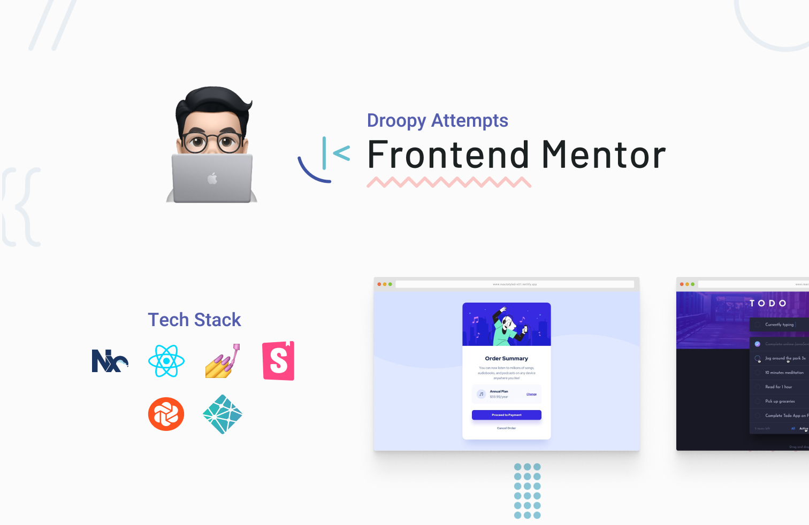

    <h1>Front End Mentor Challenges</h1>
    
React, Styled-Components, NX Monorepo  Storybook, Chromatic, Netlify

### 🤔 What is Frontendmentor?

Frontendmentor is a platform that provides front-end challenges to solve. Challenges are categories into different levels of difficulties (newbie, junior, intermediate, advanced, and guru). Each challenge are provided with a set of resources (style guide, optimized images ) to kickstart the process.

This is my second attempt at FEMentor. I previously attempted some of the challenges using only vanilla HTML, CSS and JS.

What I like about FEMentor is that as developers wanting to practise and try out new technologies, we tend to get stuck in thinking of a project idea. FEMentor eliminates that by providing the idea and resources, just as how we might receive design specs from a designer on the job.
 

<!-- TODO -->
<!-- ### 🏗 Architecture of the stack

This project was set up using NX Monorepo. The reson I chose
  -->

(<a href="#top">back to top</a>)

### 🎯 Objectives of the Stack

- Practise React
- Build custom components with Styled Components without relying on UI component librares.
- Develop with a Component Driven Development approach using Storybook
- Conduct visual regression test with Chromatic
- Understand how Monorepo works and why many are using it to create Design Systems and libraries.

<!-- TODO -->
<!-- I described more on my reasoning for the using the stacks at ____ -->
 

(<a href="#top">back to top</a>)

###🧗 Challenges Attempted
| Challenge | Difficulty | Personal Wins |
| :------------------------------------------------ | :------------------------------------------------------------- |:------------------------------------------------------------- |
| [**Order Summary Component**](/apps/no1) | Newbie | Wrote my first stories|
| [**3-Column Preview Card Component**](/apps/n02/) | Newbie | Deployed Storybook with Chromatic |
