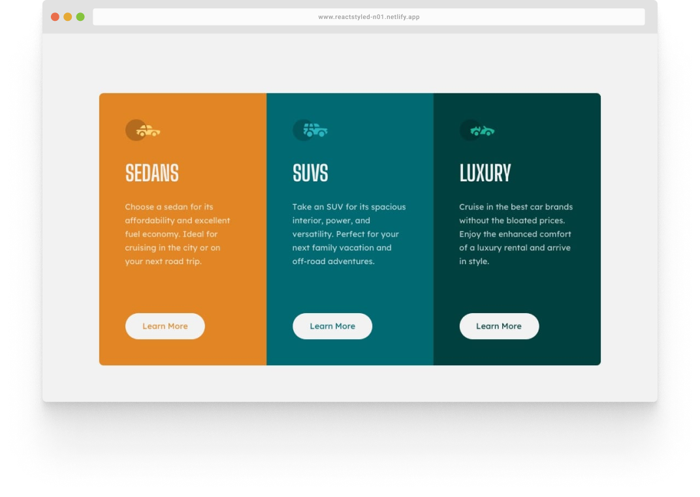
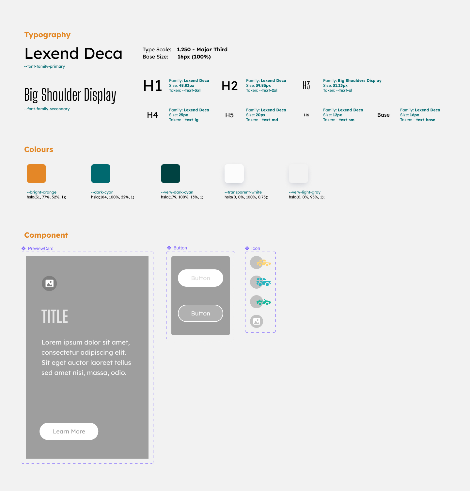

    <h1>3-column preview card component challenge hub</h2>
    
React, Styled-Components, Storybook, Netlify

    <a target="_blank" rel="noopener noreferrer" href="https://reactstyled-n02.netlify.app/"> <strong>Live Link</strong></a>
    ·
    <a target="_blank" rel="noopener noreferrer" href="https://www.frontendmentor.io/challenges/3column-preview-card-component-pH92eAR2-"> <strong>Frontendmentor</strong></a>
    .
    <a target="_blank" rel="noopener noreferrer" href="https://61dbe13082d897003a6fd67a-eyrlevycbg.chromatic.com/"> <strong>Storybook</strong></a>

   
   

The second challenge I attempted for the ReactStyled stack. I'm still getting used to writing storybook stories and thinking a lot more of the characteristics of a component. A different experience than just diving head on to develop the whole UI itself.

Because I was able to isolate and develop the card component on its own, I was able to spot possible edge cases in the component. Thanks to the Storybook Controls features, it allows me to interact with the component's argument dynamically and that gave me the ability to test the component quickly.

For example, I was trying to change the background-color of the card in the Storybook Control and as I was manually typing the color value, the background-color was "transparent" because it doesn't recognise the value. So this got me to think what if someone accidentally wrote a wrong color value? To counter that for now, I used the Web API `CSS.supports()` method to check the value.

(<a href="#top">back to top</a>)

## ✅ Functional Requirements

- User should have an optimal layout view depending on their device's screen size (min-width: 320px)
- Micro-interactions for Button [default, hover]
   
   

## ⚛️ UI Breakdown

A simple UI breakdown and style guide for the component. Designed in <a href="https://www.figma.com/file/YJaOM8biAeaVahPYgw2DLf/Frontendmentor?node-id=9%3A17" target="_blank" rel="noopener noreferrer">Figma</a>

 

## 🧗 Challenges Faced

- Using Chromatic to publish the Storybook. As I was using NX for the Monorepo, the structure of the files are different and I had to spend time figuring out how to get it to work.
- The behaviour of the card component. When I was developing the card on its own on Storybook. It looks great. But the moment I combined it into the 3 columns preview, the display and alignment went cray.
 
 

(<a href="#top">back to top</a>)

## 🧠 What I Learned

- Using React `onError` handler to trigger a function to replace the broken image with a fallback image.
- An isolated component behaves differently when fuse with others (3 card components). Should the component have its own layout properties? a fixed box model value?
- Using `CSS.support()` to check css values.
- Extrinsic vs Intrinsic Image size
- I am still clueless when it comes to dealing with packages
- I ~~know~~ don't know the purpose of `NODE_ENV`
- Using CSS property `outline` instead of `border` to create button border will prevent weird height increase,
 
 

(<a href="#top">back to top</a>)

## 📈 Improvement Backlog

- [ ] Do Visual Regression Test with Chromatic
- [ ] Include Chromatic into the CI pipeline
- [ ] Make the Button accesible
- [ ] Understand extrinsic, intrinsic image size. Then test the icons.
     
     

(<a href="#top">back to top</a>)

## 🙇🏻‍♂️ References

- https://stackoverflow.com/questions/65041989/storybook-angular-nx-workspace-how-to-publish-using-chromatic
- https://github.com/nrwl/nx/issues/8403

(<a href="#top">back to top</a>)

