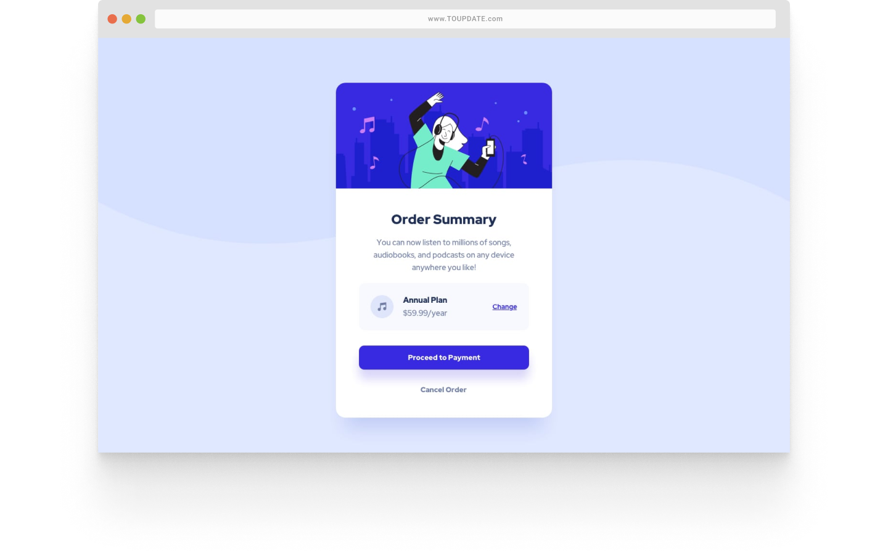
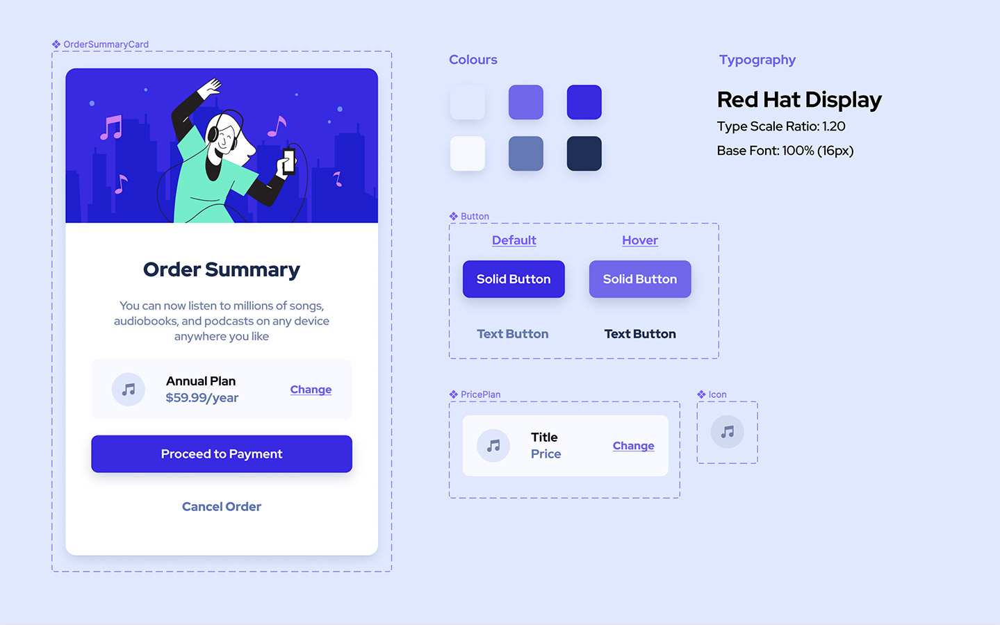

    <h1>Order Summary Component</h2>
    
React, Styled-Components, Storybook, Netlify

    <a href="https://reactstyled-n01.netlify.app/"> <strong>Live Link</strong></a>
    ·
    <a href="https://www.frontendmentor.io/challenges/order-summary-component-QlPmajDUj"> <strong>Frontendmentor</strong></a>
    .
    <a href="https://61dcd17b675c7a003aef85f1-vvklbfcdze.chromatic.com/"> <strong>Storybook</strong></a>

   
   

This challenge was my first attempt developing with the ReactStyled stack that I had planned for. It took me awhile to set the project up as I was trying out a number of new stuffs. First was setting up the monorepo with NX, and second was understanding how to build UI components with the CDD approach using Storybook.js . For more info on this approach, check out the root project README.

Instead of my usual process of developing UI by just writing the HTML structure and css classes (SASS with BEM approach), I find myself spending extra time thinking of how I would built the button component. Thoughts such as what props would it recieve, should I split the button variants into two componets (TextButton, SolidButton), or combine into one.

(<a href="#top">back to top</a>)

## ✅ Functional Requirements

- Mobile-Friendly (min-width: 320px)
- Micro-interactions for Button [default, hover]
   
   

## ⚛️ UI Breakdown

A quick UI breakdown of the components in <a href="https://www.figma.com/file/YJaOM8biAeaVahPYgw2DLf/Frontendmentor?node-id=0%3A1">Figma</a>

 

## 🧠 What I Learned

- Using ThemeProvider to list the design tokens.
- How to deploy a an app in a monorepo with Netlilfy.
- Writing storybook stories.
- Setting up storybook structure with the decorators and parameters.
 
 

(<a href="#top">back to top</a>)

## 🧗 Challenges Faced

- Reading and understanding how different Design Systems built their Button components. I find it hard to comprehend the syntax and code patterns written.
- Time Management.
- Remembering the token naming that I wrote myself. I had to constantly refer to the GlobalTheme.js file which had the tokens. To counter this, I created a Theme page in Storybook which acts like a style guide for me that provided a more visual documentation.
 
 

(<a href="#top">back to top</a>)

## 📈 Improvement Backlog

- [ ] Test the Buttons with Chromium
- [ ] Make the Button accesible
- [ ] Provide a fallback image
- [ ] Image Optimization
- [ ] Light/Day Mode
     
     

(<a href="#top">back to top</a>)

## 🙇🏻‍♂️ References

- https://getcssscan.com/css-box-shadow-examples
- https://type-scale.com/

(<a href="#top">back to top</a>)

